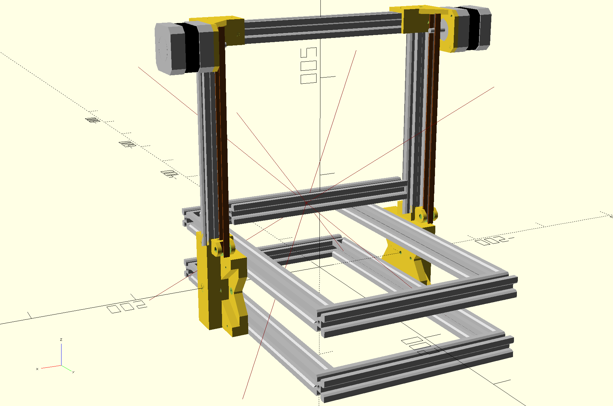

The Swoon, a folding RepRap
============================

The Swoon is a fork of [Emmanuel Gilloz's Foldarap](https://github.com/EmmanuelG/Foldarap), aimed at upgrading
it with a new motion system based on belts and linear rails, as well as making it compatible with the [EVA 3.0 carriage platform](https://main.eva-3d.page/).

The original SketchUp CAD model has mostly been recreated in [OpenSCAD](https://openscad.org/).

This project is still heavily WIP. Belted Z has been implemented, with the rest coming shortly.
